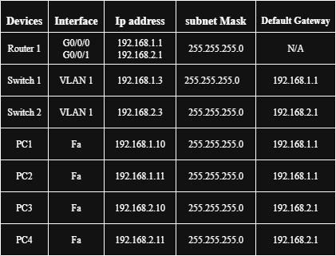
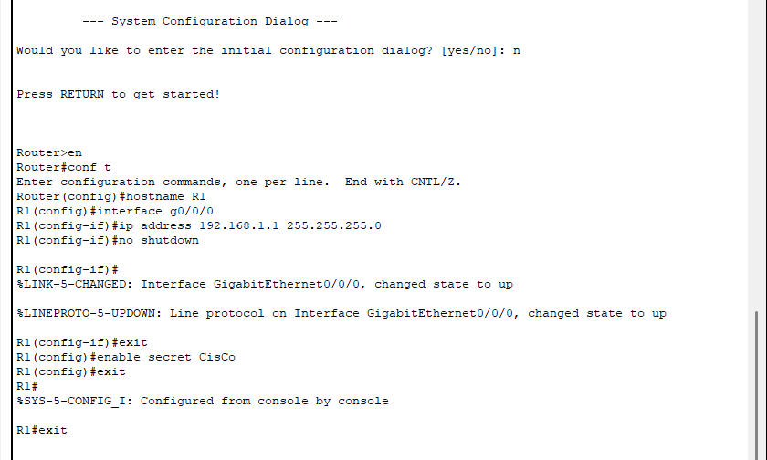
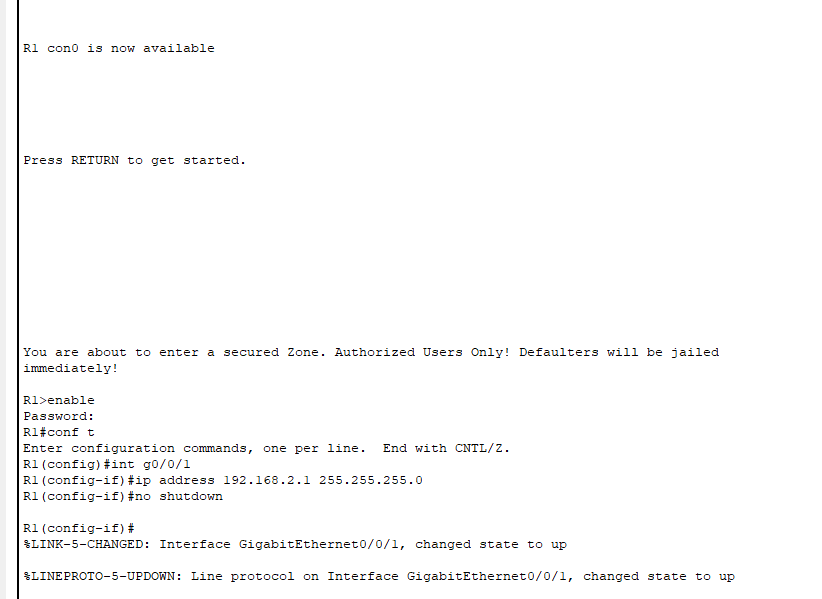
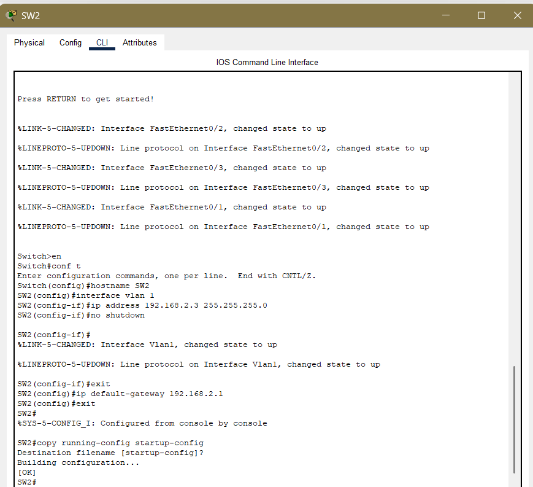
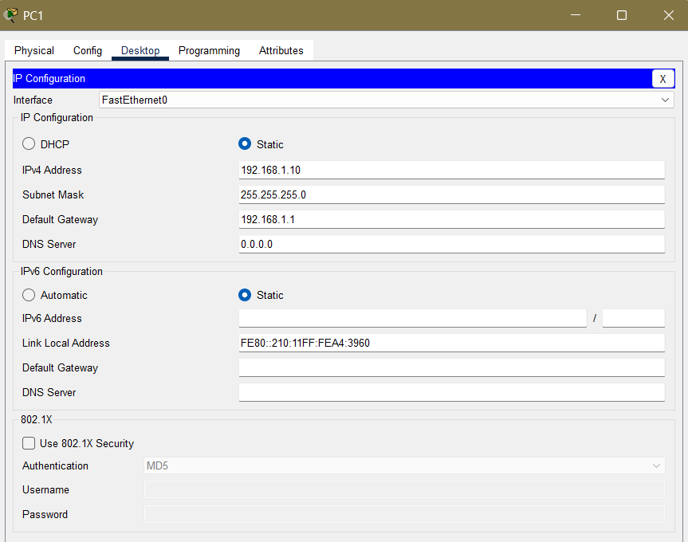
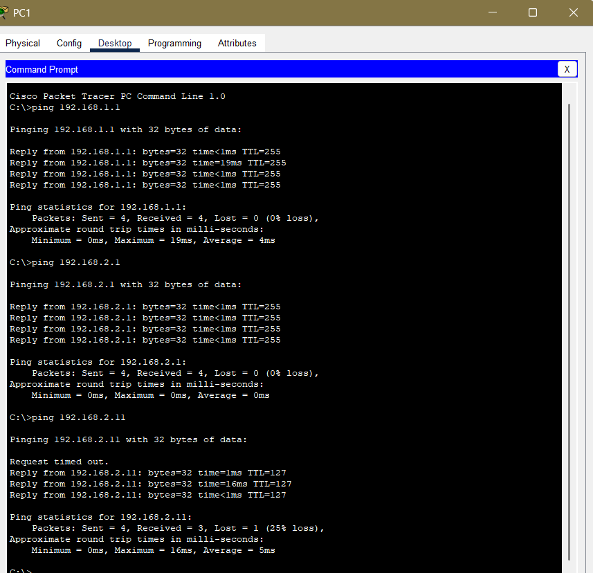
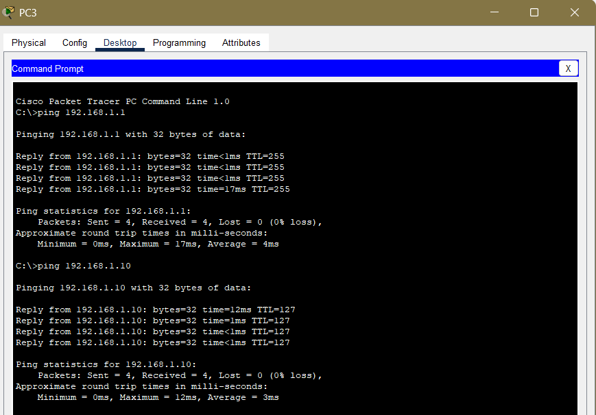

# SOHO-Network-Design-and-Simulation-Cisco-Packet-Tracer
This project demonstrates the design and simulation of a Small Office/Home Office (SOHO) network using Cisco Packet Tracer. The network consists of switches, hosts, and router, configured for basic connectivity and IP addressing.
# Network Topology
- 1 Router (for inter-VLAN and internet access)
- 2 Switches (to segment the network and connect hosts)
- 4 PCs (Hosts) connected to the switches
  

## Devices Used

## IP Addressing Plan

# Basic Configuration steps
## Router
- IP address and secret Password configuration

- Confirm Message of the day

## Switches 
- SVI configuration to enable remote management
 

## PCs
- Assign IP addresses manually

# Connectivity Test
- Ping command from PC 1

- Ping command from PC 3

# Learning Points 
- Designing a structured small office network
- Configuring encrypted password and MOTD banner
- Configuring management VLAN interfaces
- Assigning IP addresses and gateways
- Verifying network connectivity with ping command
- Understanding physical and logical topology
